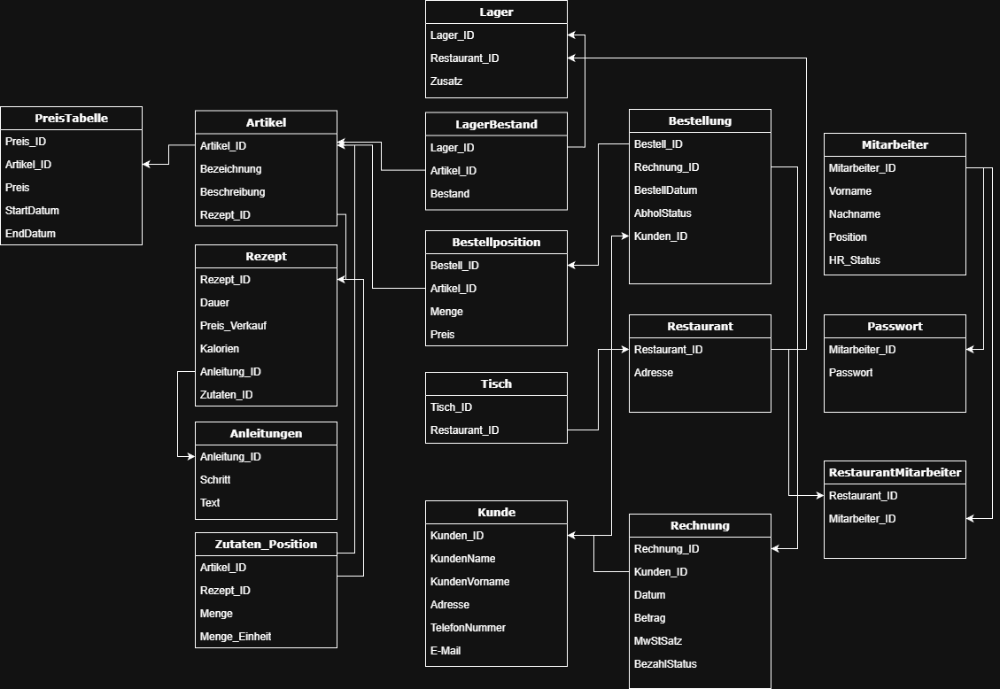

# Pinguin-Paradies
Ein Restaurantverwaltungs tool, welches über eine Console genutzt wird
---
# Aufgabe: Erstelle eine Restaurantverwaltung
(Änderungen sind vorbehalten)

## Requirements:
- Inventarverwaltung
- Kundenbestellung abwickeln (Zum Mitnehmen)
- Gewinne und Ausgaben erfassen 
    (Inventarverwaltung (+ Miete, Strom, ...) / Kundenbestellung)
    Abhängig vom Systemdatum, dass Miete usw. immer zum 1. abgezpgen wird
- Rezepte vorschlagen
- Kundenpräferenzen zu erlernen
    Kundenkarte mit ID und soweiter
    Kunde hat Liste mit bestellten Gerichten. bei Bestellung Nummer erhöhen.
    -> Höchste Nummer die zuletzt gekauft wurde vorschlagen
- Tischverwaltung für Restaurant (Bestellung, status, bezahlt, ...)
- Mehrwertsteuer unterschiedlich berechnen für Mitnahme oder vor ort

# Umsetzung:
## SSH-Server mit verschiedenen Applikationen und Login
1. Screen -> Login (user/passwd)
    Berechtigungsvergabe für verschiedene Bereiche
2. Screen -> Home für verschiedene Anwendungen. 
    Hier wird zu den weiteren Anwendungen weitergeleitet.
    1. -> Inventarverwaltung
    2. -> Kundenbestellung
    3. -> Gewinne und Ausgaben erfassen
    Darstellung als Tabelle? Zur direkten Übersicht aller Aus- und Einnahmen
    4. -> Rezepte vorschlagen 
    Möglichkeiten prüfen, welche Rezepte noch verfügbar sind
    Eventuell auch für Bestellung wichtig
    5. -> Kundenpräferenz erlernen
    Verwaltung mit Kundenkarten (ID, name, ....)
    6. -> Tischverwaltung für Restaurant
    ZUSÄTZLICH! Möglichkeit wie bei megges

Zur Umsetzung wird Python als cmd Anwendung verwendet.
Das Backend besteht dabei aus einer Datenbank und einem SSH Server.
Diese Server sollen gekapselt in einem Docker Container laufen.
Dadurch soll der direkte Datenbankzugriff vermieden werden und alles über die Eingabe der Shell verwaltbar sein.

## DB Schema:
- Artikel
- Kunde
- Bestellung
- Bestellposition
- Rechnung
- Lager
- PreisTabelle
- Mitarbeiter

# Mögliche Packages:
    COLORAMA für Farbe
    ART.ASCII (text2art) für CLI Art von Texten

# Start
start des Servers über python main.py
Anmelden mit cmd > ssh <USER>@<Serveradress>
ssh admin@localhost