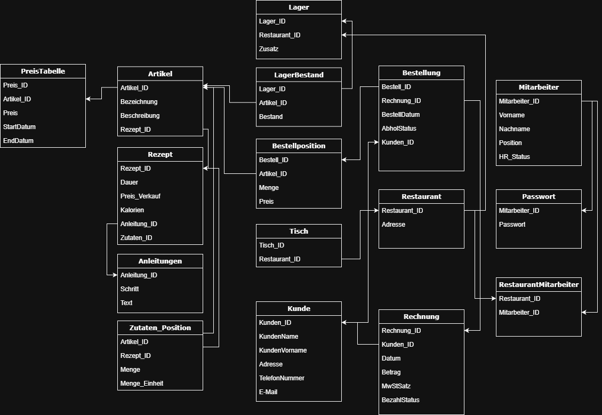

# PenguEats
Ein Restaurantverwaltungs tool, welches über eine Console genutzt wird
---
Auszug aus der Vorlesungs-PDF der 1. Vorlesung:

Idee: Wie kann ein Pinguin Python nutzen, um ein erfolgreiches Fischrestaurant zu führen und zu erweitern?  
Aufgabe: Erstelle eine Python-basierte Anwendung, in der Pingu, der Pinguin, ein Fischrestaurant eröffnet und Code verwendet, um:
- Inventar zu verwalten (Fischarten, Menge, Frische)
- Kundenbestellungen abzuwickeln (andere Tiere, die das Restaurant besuchen)
- Gewinne und Ausgaben zu erfassen (Eisblockmiete, Kosten für Fischlieferanten)
- Rezepte vorzuschlagen (basierend auf dem vorhandenen Fischbestand)
- Kundenpräferenzen erlernen

## Requirements:
- Inventarverwaltung 
- Kundenbestellung abwickeln
- Gewinne und Ausgaben erfassen 
- mögliche Rezepte anhand des Bestands darstellen
- Kundenpräferenzen erlernen. Dabei soll aufgrund der letzen 10 Bestellungen eines Kunden das Häufigste ausgewählt werden
- Tischverwaltung für Restaurant (Bestellung, status, bezahlt, ...)
- Mehrwertsteuer unterschiedlich berechnen für Mitnahme oder vor ort

# Umsetzung:
## SSH-Server mit verschiedenen Aktionen und Logins
### Login (user/passwd)
- Anmeldung am Server soll nur für Personen mit Passwort möglich sein. Zur Vereinfachung hat jeder Nutzer Zugriff auf alle Bereiche.
### Home für verschiedene Anwendungen
Hier wird zu den weiteren Anwendungen weitergeleitet.
1. -> Bestellen
2. -> Einlagern
3. -> Inventar anzeigen
4. -> Gewinne und Ausgaben erfassen

## DB Schema:
Hierbei lässt sich das Projekt in Gruppen aufteilen:
1. Rezepte/Artikel
2. Bestellungen
3. Restaurant/Mitarbeiterverwaltung
4. Kunden

### Rezepte/Artikel:

Zentral für diesen Zusammenhang ist dabei die Rezept-Tabelle. Hier werden die Kalorienanzahl, die Dauer und der Preis des Rezeptes, mit dem es angeboten wird, gespeichert.
Die Referenz zu der Anleitungen-Tabelle ist dafür da, innerhalb der Küche die Anleitung für die Rezepte passend darzustellen. Dabei wird diese über die Spalten Anleitung_ID und Schritt selektiert und anhand der "Schritt"-Spalte geordnet. Diese beiden Spalten bilden dabei den Primärschlüssel.
Die Zutaten des Rezeptes werden über die Zutatentabelle geregelt. Dabei gibt es eine n:m-Beziehung zwischen Rezept und Zutat. Zutaten sind dabei Artikel. Die Beziehung wird über die Tabelle Zutaten_Position gespeichert. Zusätzlich zur Information von Rezept und Artikel_ID werden auch die Menge und die Mengeneinheit gespeichert. Dadurch kann eine Zuordnung und die benötigte Menge abgespeichert werden und über einen Vergleich zur Lagertabelle kann ermittelt werden, ob noch genügend Artikel verfügbar sind.

### Bestellungen:
Bestellungen werden an der Theke erstellt. Dabei beinhaltet jede Bestellung automatisch eine Rechnung, ein Bestelldatum und einen Abholstatus, welcher signalisiert, in welchem Status die Bestellung ist. Diese reichen von "Eingegangen" über "In Bearbeitung" zu "abgeholt". Eine Rechnung ist mit jeder Bestellung direkt mit einbegriffen. Eine Bestellung besteht dabei aus mehreren Positionen, welche in der Tabelle Bestell_Position dargestellt werden. Zusätzlich zu den Informationen, welche Bestellung welche Rezepte beinhaltet, gibt es noch die Information über die Menge eines bestellten Rezeptes und den Preis. Gerichte werden als Artikel referenziert. Jeder Artikel besitzt die Spalte "Rezept_ID", mit welcher klassifiziert werden kann, ob es sich bei diesem Artikel um eine Speise oder eine Zutat handelt. Zutaten besitzen kein Rezept, weshalb sie über die Bedingung REZEPT_ID IS NULL eingegrenzt werden können. Zusätzlich können Angebote über die Preiszabelle dargestellt werden.

### Restaurant/Mitarbeiterverwaltung:
Mitarbeiter werden über eine ID identifiziert und mit persönlichen Informationen wie Name und Vorname weiter angereichert. Jeder Mitarbeiter, welcher Zugriff auf die Konsole haben soll, hat einen Eintrag innerhalb der Tabelle "Passwort". Diese bestelt aus den zwei Spalten "Mitarbeiter_ID" und "Passwort". Dieses wird gehasht gespeichert. Beim Passwortwert von NULL wurde das Passwort zurückgesetzt und ein neues soll eingegeben werden. Die Mitarbeiter sind einem Restaurant zugeordnet. Diese n:m-Beziehung wird über die Tabelle "RestaurantMitarbeiter" gespeichert. Dabei besteht die Tabelle nur aus Restaurant_ID und Mitarbeiter_ID. Ein Restaurant hat dabei eine ID und eine Adresse. Tische innerhalb eines Restaurant werden dabei direkt dem Restaurants über die ID zugewiesen.

### Kunden:
Kunden sind das Herzstück eines jeden Restaurants und Betriebs. In jedem Restaurant kann jeder bestellen und alle Rezepte erhalten. Bei Registrierung eines Kunden werden die Kundeninformationen in der Tabelle "Kunde" gespeichert. Dabei erhält ein registrierter Kunde eine Kunden-ID, welche bei der Bestellung angegeben werden kann. Dadurch lassen sich Präferenzen aus den bisherigen Bestellungen ableiten. Dem Kunden bietet es den Vorteil, dass dieser über Aktionen oder Ähnliches informiert wird. Kundenpräferenzen können dabei allerdings erst ab der 10. Bestellung ermittelt werden.

Die Beziehung aller Tabellen ist in folgendem Diagramm zu sehen:

# Technische Umsetzung

Als Programmioersprache wird laut Anforderung des Kurses die Sprache Python genutzt. 
Für die Erstellung eines SSH Servers wird das Paket twisted verwendet. Dadurch lässt sich ein Server aufsetzen, welcher eingehende Befehel erkennt und über Abfragen direkt Methoden ausführen lässt. Die Datenbank wird über das Paket sqlite3 angesteuert und innerhalb der Datei database.db gespeichert und verwaltet. Die Datenbankstruktur ist im Punkt DB Schema angegeben und näher beschrieben.

Deployed werden soll das Projekt als Dockercontainer, damit dies unabhängig von Betriebsystem entwicklet werden kann und über jeden Server betrieben werden kann. Ein Server wird dafür primär nicht benötigt. Lediglich ein PC, welcher für die Restaurantkette zur Verfügung steht. Beim Wachsen der Kette sollte allerdings auf einen Server gewechselt werden, da dieser Zuverlässiger funktioniert und Funktionalitäten wie ein Backup und Sicherheitsaspekte beinhaltet. 

Der Zugriff auf den Server wird abgesichert, da hier beim Start des Servers ein SSH-Keypaar generiert wird, mit dem sich jeder Client identifizieren kann.
Dies wird über den Befehl "ssh-keygen -t ed25519 -f id_ed25519" erreicht. 

# Probleme:
### Keine Verbindung/Connection Refused:
Start des Conatiners über WSL ohne bspw. Docker Desktop -> Verbindung auch nur über wsl möglich.

### SSH-Keys sind nicht akzeptiert:
-> Löschen der Datei "known_hosts" unter user/.ssh

# Verwendung dieses Projektes:
## Start
    start des Servers über "python main.py" oder
    "docker build -t pinguin-paradis:latest . && docker run -it -p 22:22 pinguin-paradis:latest"
    Docker-compose ist aktuell noch nicht implementiert
    Anmelden mit cmd > ssh <USER>@<Serveradress>
    ssh admin@localhost

## Bestellung
Start über Befehl "Bestellen"
Eingabe und Abfrage von der CLI was bestellt werden soll (über zahleneingabe oder Text: Burger(1) -> 1 oder Burger)
- Eingabe der Kundennummer (Optional)
- Eingabe des Artikels über nummer oder name
- Menüs sollen auch möglich sein
- Wie viel und welche extras
- Wiederholen, solange der Kunde noch was bestellen will
- Bestellung in DB Speichern

## Artikel in lager hinzufügen
Start über Befehl "Einlagern"
- Artikelnummer und Menge eingeben
- Speichern in Datenbank